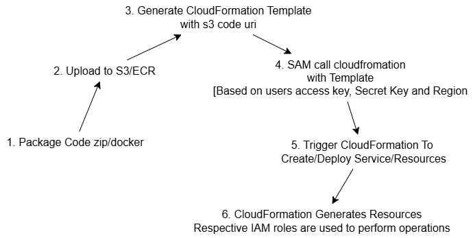

# What Is SAM?
- Serverless Application Model used for deployment of different AWS Resources

# Configurations:
- Download SAM and AWS cli in Local
- Download Docker if need to use different AWS Resource in local ex. Lambda, SQS, ECS,EC2, DynamoDB, etc.

# How it works?
- Need to create tempate in template.yml file
- This file contains Resources/Service which needs to be deployed or generated
- Steps to generate Sample SAM in local:
```sh
sam init
```
- This will prompt you to choose:

1. Template source → Select AWS Quick Start Templates.
1. Runtime → Choose nodejs18.x.
1. Choose zip or Image
1. Application template → Select SQS Processor for an SQS-triggered Lambda.
1. Project name → Provide a name like lambda-sqs-app.
- After running this, SAM will generate a project with a template.yaml file and samconfig.toml file.
- samconfig.toml : config file for SAM

# Structure Of template.yml file
```yml
AWSTemplateFormatVersion: '2010-09-09'
Transform: AWS::Serverless-2016-10-31

Resources:
  MyLambdaFunction:
    Type: AWS::Serverless::Function
    Properties:
      FunctionName: MyFunction
      Runtime: nodejs18.x
      Handler: index.handler
      CodeUri: .
      MemorySize: 128
      Timeout: 10
      Policies:
        - AWSLambdaBasicExecutionRole
      Events:
        ApiTrigger:
          Type: Api
          Properties:
            Path: /hello
            Method: GET

Outputs:
  ApiUrl:
    Description: "API Gateway endpoint"
    Value: !Sub "https://${ServerlessRestApi}.execute-api.${AWS::Region}.amazonaws.com/Prod/hello"
```
### Explanation:
- `AWSTemplateFormatVersion`: Defines the CloudFormation template version.
- `Transform`: Specifies that we are using AWS SAM.
- `Resources`:
  - MyLambdaFunction: Defines an AWS Lambda function.
  - Runtime: Uses Node.js 18.
  - Handler: Specifies the file (index.js) and function (handler).
  - CodeUri: Points to the source code directory.
  - MemorySize and Timeout: Set resource limits.
  - Policies: Grants basic execution permissions to Lambda.
  - Events: Defines an API Gateway trigger (/hello).
- Outputs:
  - ApiUrl: Provides the API Gateway URL after deployment.

## How can create Resources
- Template:
```yml
Resources:
  <ResourceName>:
    Type: AWS::<Service>::<ResourceType>
    Properties:
      <PropertyKey>: <Value>
```
- `Properies are resource Specific`

## 1️⃣ Lambda Function with API Gateway
```yml
Resources:
  MyLambdaFunction:
    Type: AWS::Serverless::Function
    Properties:
      FunctionName: MyFunction
      Runtime: nodejs18.x
      Handler: index.handler
      CodeUri: .
      MemorySize: 128
      Timeout: 10
      Policies:
        - AWSLambdaBasicExecutionRole
      Events:
        ApiTrigger:
          Type: Api
          Properties:
            Path: /hello
            Method: GET
```

## 2️⃣ DynamoDB Table
```yml
Resources:
  MyDynamoDBTable:
    Type: AWS::DynamoDB::Table
    Properties:
      TableName: MyTable
      AttributeDefinitions:
        - AttributeName: id
          AttributeType: S
      KeySchema:
        - AttributeName: id
          KeyType: HASH
      BillingMode: PAY_PER_REQUEST
```
## 3️⃣ S3 Bucket
```yml
Resources:
  MyS3Bucket:
    Type: AWS::S3::Bucket
    Properties:
      BucketName: my-sam-app-bucket
```

# Referencing Resources in Other Parts
- Once created, resources can be referenced using `!Ref` or `!GetAtt`.

##  Example: Lambda Writing to DynamoDB
```yml
Resources:
  MyLambdaFunction:
    Type: AWS::Serverless::Function
    Properties:
      FunctionName: MyFunction
      Runtime: nodejs18.x
      Handler: index.handler
      CodeUri: .
      Policies:
        - DynamoDBCrudPolicy:
            TableName: !Ref MyDynamoDBTable
```
>🔹 This grants the Lambda function permission to read/write to MyDynamoDBTable.


# How can create and Configure IAM roles, Security groups VPC 
## 1️⃣ Creating and Attaching IAM Roles
```yml
Resources:
  MyLambdaExecutionRole:
    Type: AWS::IAM::Role
    Properties:
      RoleName: MyLambdaRole
      AssumeRolePolicyDocument:
        Version: "2012-10-17"
        Statement:
          - Effect: Allow
            Principal:
              Service: 
                - lambda.amazonaws.com
            Action: 
              - sts:AssumeRole
      Policies:
        - PolicyName: LambdaDynamoDBPolicy
          PolicyDocument:
            Version: "2012-10-17"
            Statement:
              - Effect: Allow
                Action:
                  - dynamodb:PutItem
                  - dynamodb:GetItem
                  - dynamodb:Scan
                  - dynamodb:Query
                Resource: !GetAtt MyDynamoDBTable.Arn

  MyLambdaFunction:
    Type: AWS::Serverless::Function
    Properties:
      FunctionName: MyLambda
      Runtime: nodejs18.x
      Handler: index.handler
      CodeUri: .
      Role: !GetAtt MyLambdaExecutionRole.Arn
```
### ✅ Explanation:

- Creates an IAM Role (MyLambdaExecutionRole) with permissions to access DynamoDB.
- Attaches the role to a Lambda function.

## 2️⃣ Creating a VPC and Attaching to Lambda
```yml
Resources:
  MyVPC:
    Type: AWS::EC2::VPC
    Properties:
      CidrBlock: "10.0.0.0/16"
  
  MySubnetA:
    Type: AWS::EC2::Subnet
    Properties:
      VpcId: !Ref MyVPC
      CidrBlock: "10.0.1.0/24"
      AvailabilityZone: !Select [ 0, !GetAZs "" ]

  MySubnetB:
    Type: AWS::EC2::Subnet
    Properties:
      VpcId: !Ref MyVPC
      CidrBlock: "10.0.2.0/24"
      AvailabilityZone: !Select [ 1, !GetAZs "" ]

  MyLambdaFunction:
    Type: AWS::Serverless::Function
    Properties:
      FunctionName: MyLambda
      Runtime: nodejs18.x
      Handler: index.handler
      CodeUri: .
      VpcConfig:
        SubnetIds:
          - !Ref MySubnetA
          - !Ref MySubnetB
        SecurityGroupIds:
          - !Ref MySecurityGroup
```
## 3️⃣ Creating Security Groups and Attaching to Lambda/EC2
```yml
Resources:
  MySecurityGroup:
    Type: AWS::EC2::SecurityGroup
    Properties:
      GroupDescription: "Allow HTTP and database access"
      VpcId: !Ref MyVPC
      SecurityGroupIngress:
        - IpProtocol: tcp
          FromPort: 443
          ToPort: 443
          CidrIp: "0.0.0.0/0"
        - IpProtocol: tcp
          FromPort: 3306
          ToPort: 3306
          CidrIp: "10.0.0.0/16"
```

---
## 4️⃣ Creating an RDS Database and Attaching a Security Group
```yml
Resources:
  MyRDSInstance:
    Type: AWS::RDS::DBInstance
    Properties:
      DBInstanceIdentifier: MyDatabase
      Engine: MySQL
      DBInstanceClass: db.t3.micro
      AllocatedStorage: 20
      MasterUsername: admin
      MasterUserPassword: MySecurePassword
      VPCSecurityGroups:
        - !Ref MySecurityGroup
      DBSubnetGroupName: !Ref MyDBSubnetGroup

  MyDBSubnetGroup:
    Type: AWS::RDS::DBSubnetGroup
    Properties:
      DBSubnetGroupDescription: "Subnet group for RDS"
      SubnetIds:
        - !Ref MySubnetA
        - !Ref MySubnetB
```
# 📌 AWS Resource Summary

| Resource | AWS Type | Purpose |
|----------|---------|---------|
| **IAM Role** | `AWS::IAM::Role` | Grants permissions to AWS resources (Lambda, EC2, etc.). |
| **VPC** | `AWS::EC2::VPC` | Isolates AWS resources inside a private network. |
| **Security Group** | `AWS::EC2::SecurityGroup` | Controls inbound/outbound traffic. |
| **Subnet** | `AWS::EC2::Subnet` | Defines IP ranges inside a VPC. |
| **Lambda in VPC** | `AWS::Serverless::Function` | Attaches Lambda to a private network. |
| **RDS with VPC** | `AWS::RDS::DBInstance` | Deploys a relational database in a private network. |

---


# How to Deploy:
1. Initialize a new SAM app:
```sh
sam init
```
2. Build the application:
```sh
sam build
```
3.Deploy
```sh
sam deploy --guided
```

## Local invoke 
```sh
sam local invoke functionName
```

## Deployment Process
