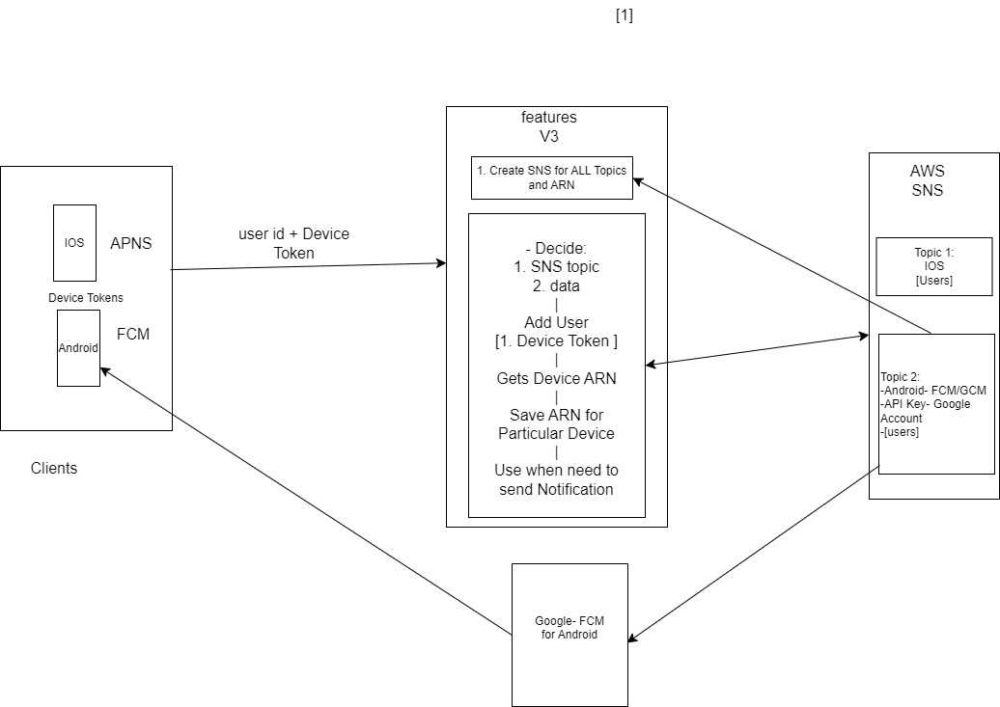

## Push Notifications General Flow :
```text
[ANDROID/IOS : Device Token + user_id] -->  SNS Topic Object [ARN] (API key is used when creating Topic in AWS Console)
 --> Add User [Device Token +userId] --> Get New ARN for Device --> Save to DB 
```

# General Scenario :
### 1. ANDROID/IOS: Device Token + user_id:

- When a user installs the mobile app and registers for notifications, the mobile app requests a device token from the respective platform:
  - Android: Firebase Cloud Messaging (FCM) provides a device token.
  - iOS: Apple Push Notification Service (APNS) provides a device token.
- This device token, along with the user_id, is sent to your backend system.
### 2.SNS Topic Object [ARN] (API key used when creating the topic): Platform Application ARN

- In the AWS Console or using the AWS SDK, you create an **SNS Platform Application [for Topics]** for both iOS (APNS) and Android (FCM).
- This Platform Application has an Amazon Resource Name (ARN), and when you create it, you provide the API keys for the respective notification services (APNS or FCM).
- Each **Platform Application ARN is tied to a specific app and device type (Android or iOS)**.
### 3.Add User [Device Token + userId]:

- After receiving the device token from the app, your backend can use AWS SNS to create a **Platform Endpoint for that 'specific device token'**.
- The **"device token"** and userId are linked, and an **Endpoint ARN is created in SNS**. Each device token has its own unique Platform Endpoint ARN.
### 4.Get New ARN for Device: Platform Endpoint ARN

- When you call the createPlatformEndpoint API (or use the console), AWS SNS generates a **new "Platform Endpoint ARN" for that specific device token**.
- This Platform Endpoint ARN is used to send notifications to that particular device.
- If the device token is invalidated (e.g., due to app uninstall/reinstall), a new Platform Endpoint ARN needs to be created.
### 5.Save to DB:

- The Platform Endpoint ARN is saved to your database, along with the user_id and possibly other metadata (e.g., device type).
- This allows you to associate each user's device(s) with the respective ARN(s) for future push notifications.


# Detailed Example of the Process:

### 1. Mobile App Registration:

- App on Android/iOS sends the device token and user information (e.g., user_id) to your backend.
```json
{
  "user_id": "12345",
  "device_token": "abc123token",
  "platform": "iOS" // or "Android"
}
```
### 2. Create Platform Endpoint ARN (AWS SNS):
- Using the createPlatformEndpoint API, the backend creates an endpoint for the received device token and user ID.
- AWS SNS accepts the device token without immediate validation.
- **SNS generates a Platform Endpoint ARN regardless of whether the device token is valid at the time of creation**.
```js
const createPlatformEndpoint = async (platformArn, deviceToken, userId) => {
  const params = {
    PlatformApplicationArn: platformArn,  // ARN for APNS or FCM
    Token: deviceToken,                   // Device token from mobile app
    CustomUserData: userId                // Optional: Add user_id as custom data
  };

  try {
    const data = await sns.createPlatformEndpoint(params).promise();
    return data.EndpointArn;
  } catch (error) {
    console.error('Error creating endpoint:', error);
  }
};
```
### 3. Save Platform Endpoint ARN to Database:
- The returned Endpoint ARN is saved to the database along with the user_id for future reference.
```json
{
  "user_id": "12345",
  "platform_endpoint_arn": "arn:aws:sns:us-east-1:123456789012:endpoint/APNS/MyApp/abc123"
}
```
### 4.Send Notifications Using ARN:

- When sending notifications, you can look up the user's Platform Endpoint ARN in the database and send messages directly to their device using SNS:
```js
const sendNotification = async (endpointArn, message) => {
  const params = {
    TargetArn: endpointArn,  // Use the saved ARN from DB
    Message: JSON.stringify({
      default: message,      // Fallback for all platforms
      APNS: JSON.stringify({
        aps: { alert: message }  // Payload for iOS devices
      }),
      GCM: JSON.stringify({
        notification: { text: message }  // Payload for Android devices
      })
    }),
    MessageStructure: 'json'
  };

  await sns.publish(params).promise();
};
```

## Full Flow Diagram:
```
1. App → Gets Device Token (via APNS/FCM).
2. App → Sends Device Token + user_id to Backend.
Backend → Calls SNS createPlatformEndpoint with the Device Token.
3. SNS → Returns Platform Endpoint ARN for that device.
4. Backend → Saves Platform Endpoint ARN with user_id to DB.
5. Backend → Uses Platform Endpoint ARN to send push notifications via SNS.
```
## Key Components:
1. Platform Application ARN: Created for iOS (APNS) and Android (FCM). Provides the link to each platform.
2. Device Token: Unique per app install on each device. Used to target specific devices.
3. Platform Endpoint ARN: Created per device token using createPlatformEndpoint. Used to send notifications.
4. user_id: Used to associate device tokens/ARNS with specific users.

## Summary:
Your scenario is a typical flow for integrating mobile push notifications with AWS SNS:

- Device token + user ID from mobile apps are registered with SNS.
- SNS generates an ARN (Platform Endpoint) for each device.
- This ARN is stored in a database, associated with the user ID.
- The ARN is used to send targeted push notifications to the device.

This flow ensures seamless and targeted notifications to users' mobile devices, supporting iOS and Android platforms through AWS SNS.